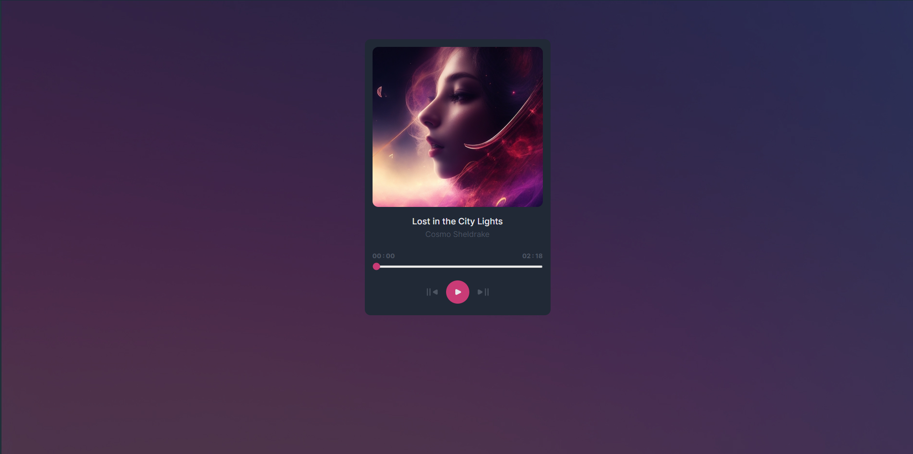
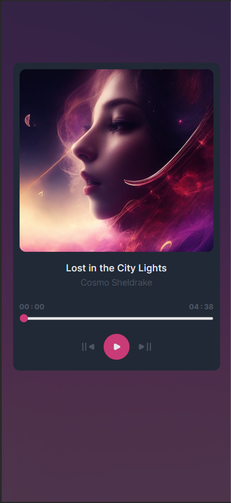

Il s'agit d'une solution pour le défi [Music Player](https://devchallenges.io/challenge/36) sur Dev Challenges.

## Table des matières

- [Aperçu](#aperçu)
  - [Le défi](#le-défi)
  - [Capture d'écran](#capture-décran)
  - [Liens](#liens)
  - [Construit avec](#construit-avec)
- [Auteur](#auteur)

## Aperçu

### Le défi

- Les utilisateurs doivent pouvoir : 

    - Jouer et arrêter la chanson en cours.

    - Passer aux chansons suivantes et précédentes.

    - Modifier le temps de lecture à l'aide de la barre de progression.

- Avoir un design responsive

### Capture d'écran

### Liens

- [URL du site en direct](music-player.bonefons.com/)

### Construit avec

- Vite (Framework React)
- TailwindCSS

## Auteur

- Dev Challenge - [@CallMeAl3x](https://devchallenges.io/profile/4b9e326e-7fac-4811-b859-ca80373be3dd)
